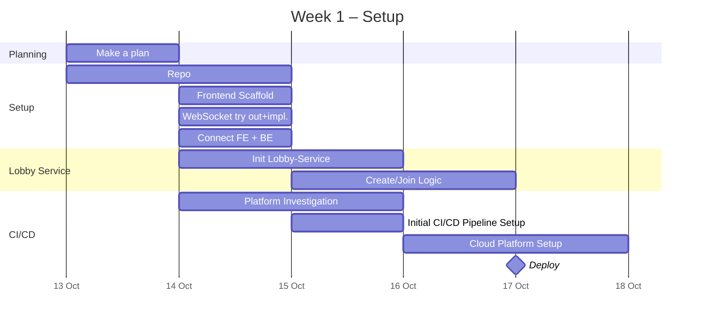
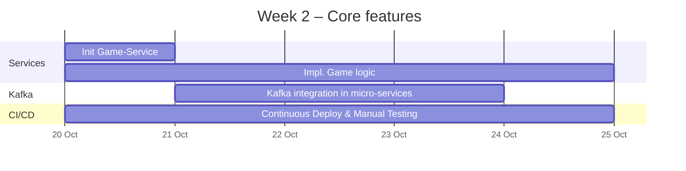
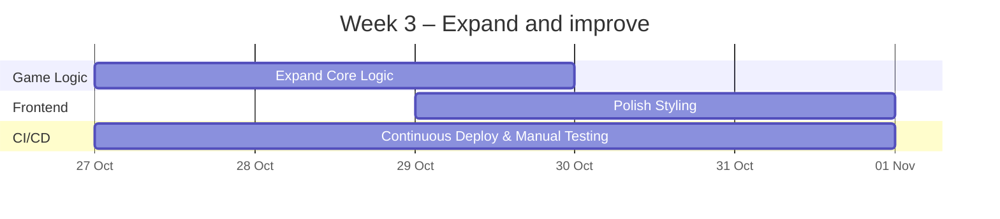
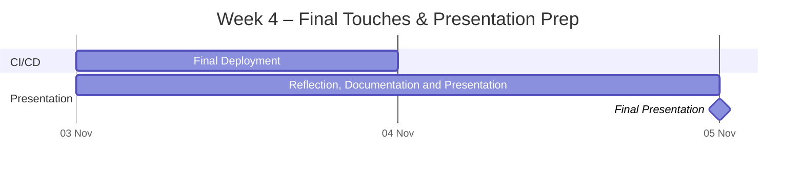

## Initial Planning

### Project Concept

*Aims to build an application that handles:*
 - **Many interactions**
 - **Real-time events**

*Designed to be:*
 - **Deployed** early and continuously

*Consist of:*
- At least **2 microservices** communicating through **Apache Kafka**
- Using **WebSockets** for live updates
- Frontend built with **Vue3**

### Tech Stack

- **Backend:** Java, Spring Boot
- **Frontend:** Vue3
- **Database:** PostgresSQL
- **Messaging:** Kafka
- **Live Communication:** WebSockets
- **Infra:** Docker
- **Deployment:** TBD

### Why?

My main focus is exploring **event-driven architecture** and **real-time communication.**
I want to challenge myself with focusing on **deployment**, building something **scalable** and easy to **maintain**. But at the same time keep it fun to build and demonstrate.

New areas to (re)discover:

- WebSocket broadcasting/live updates
- Cloud/Deployment
- Vue3

### Goals

- Demonstrate real-time multiplayer experience and event-driven design
- Deploy early and iterate continuously
- Keep frontend lightweight - let backend own all possible logic
- Have a working, deployed and polished demo for final presentation.

